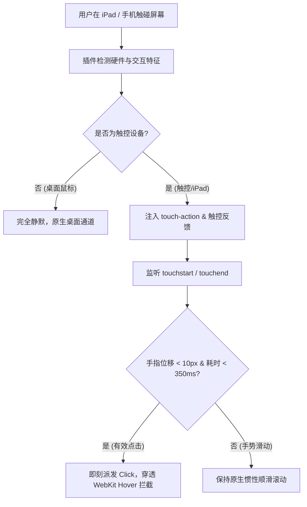

# 📱 dsh-plugin-mobile-touch

[](https://www.npmjs.com/package/@anonyjcy/dsh-plugin-mobile-touch)
[](LICENSE)

**简体中文** | [English Version](README.en.md)

> **DeepSeek Harness (DSH)** 移动端与 iPad 触控交互深度优化插件。  
> 彻底解决 WebKit 两段式 Hover 拦截、点击延迟、误判手势与触控热区小等痛点，提供 0ms 即时触控反馈与顺滑滚动体验。

---

## 🌟 核心问题与解决方案

在 iPad (Safari/WebKit) 或移动端浏览器使用 DeepSeek Harness Web 界面时，经常遇到**“点了没反应、像没点中、需要多点几下才触发”**的体验怪异问题。

### 根因分析：
1. **WebKit `:hover` 模拟拦截（核心元凶）**：WebKit 遇到带 `:hover` 样式或 Tooltip 监听的按钮时，首次点按会判定为“模拟悬停”，吃掉 `click` 事件；用户必须二次点按才能真正触发。
2. **轻微滑移被手势判定吞噬**：手指在玻璃屏轻点时若产生微小像素位移（1~3px），缺乏 `touch-action: manipulation` 会导致浏览器判定为平移/双击缩放手势起点，直接取消 `click`。
3. **触控热区过小**：桌面端小图标尺寸（16~24px）远小于手指物理接触面积（44×44pt）。

---

## ✨ 插件特性

- 🎯 **智能硬件感知**：自动识别 `pointer: coarse`、多点触控与移动端环境，**仅在触控屏上激活**；桌面鼠标环境零开销、零干扰。
- ⚡ **Fast-Tap 快速派发引擎**：在 `touchend` 阶段精准甄别有效点击，穿透 WebKit 的 Hover 拦截，实现 0ms 瞬间响应。
- 👆 **0ms 触感反馈（Active Feedback）**：手指触碰瞬间赋予微缩放与透明度按压反馈，操作感知直观明确。
- 🛡️ **消除手势冲突与 300ms 延迟**：全域注入 `touch-action: manipulation` 与 `-webkit-tap-highlight-color: transparent`，滚动与操作互不干扰。
- 🔌 **完全自动自适应（Future-Proof）**：基于全域事件代理与全局样式挂载，**后续安装的任何新 UI 插件无需单独适配，自动享有触控优化**。
- 🛠️ **一键 CLI 挂载与管理**：内置纯 ESM 原生 Node.js CLI，支持 `install`、`uninstall`、`verify` 与 `status`。

---

## 🚀 安装与一键部署

### 方式一：克隆仓库直接安装（本地使用）

```bash
git clone https://github.com/AnonyJcy/dsh-plugin-mobile-touch.git
cd dsh-plugin-mobile-touch

# 一键挂载到 DSH Web Profile (~/.dsh/profiles/web)
node bin/cli.js install

# 检查安装状态
node bin/cli.js status
```

### 方式二：通过 npm / pnpm 安装

```bash
# npm 安装
npm install -D @anonyjcy/dsh-plugin-mobile-touch

# pnpm 安装
pnpm add -D @anonyjcy/dsh-plugin-mobile-touch

# 运行 CLI 一键挂载
npx @anonyjcy/dsh-plugin-mobile-touch install
```

---

## 💡 配置文件组装 (`cordis.yml`)

插件支持直接在 `cordis.yml` 或 `cordis.patch.yml` 中声明：

```yaml
- id: plugin-mobile-touch
  name: '@anonyjcy/dsh-plugin-mobile-touch'
  config:
    force: false       # 是否强制在所有设备激活（默认 false，仅触控设备激活）
    disabled: false    # 是否禁用插件（默认 false）
```

---

## 🛠️ CLI 命令一览

```bash
node bin/cli.js install [profile]    # 挂载触控优化插件到 DSH profile（默认: web）
node bin/cli.js uninstall [profile]  # 从 DSH profile 干净卸载插件
node bin/cli.js verify [profile]     # 校验安装与软链接完整性
node bin/cli.js status [profile]     # 查看当前安装状态与配置路径
```

---

## 🧩 工作原理



---

## 📄 开源许可证

本项目基于 [MIT License](./LICENSE) 开源。
